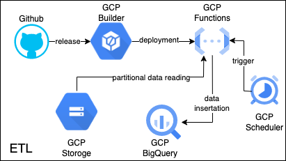

# gcp-functions-cronJob

In this project I try to build etl pipeline and store the data in BigQuery with google cloud platform. To create etl pipeline I use gcp functions as processor and gcp scheduler as trigger. I build 2 different pipeline one of them is extract currency data and insert currency values daily and the second one is extract some informarmation on gcp storege, apply some logics and update BigQuery.

## Architecture

At the below there is a architecture snapshot which contain 3 nodes with decision maker node. 

  

## Etl Jobs & Tables
* **Currency etl job** In this etl job I use currency converter and insert currency information based on 'US' currency. Sample table: 

| dt     | code   | rate   |
| ------ | ------ | ------ |
| date   | string | float  |

* **Ad Network etl job** In this etl job I update network cost information from bucket to bigQuery with some logics. This etl job update 2 table one of them contain ad network info and the other one contain processed files.

| dt     | file_name |
| ------ | --------- |
| date   | string    |

| dt     | network | currency | platform | cost  | cost_usd | file_name |
| ------ | ------- | -------- | -------- | ----- | -------- | --------- |
| date   | string  | float    | string   | float | float    | string    |

## CI/CD

To deploy the changes I use gcp builder with github releases. To release the changes I use tags. There is 2 type of tag for each etl job. 
Currency etlJob tag: `currency0.0.0`  
Ad Network etlJob tag: `adnetwork0.0.0`  

## Development

In the development phase I used dev BigQuery tables and functions framework with this setup we can similate production. To run this framework with environment variables use following cmds.

`CURRENCY_TABLE='<table_name>' GOOGLE_APPLICATION_CREDENTIALS='<credentials_path>' functions-framework --target http_currency_updater --debug`

`AD_NETWORK_TABLE='<table_name>' PROCESSED_FILE_TABLE='<table_name>' BUCKET_NAME='<bucket_name>' GOOGLE_APPLICATION_CREDENTIALS='<credentials_path>' functions-framework --target http_ad_network_updater --debug`

## Parametric Exacution

Normaly the etl jobs trigger with `{}` body but in some cases we could run etl jobs with predefined parameters to check parameters check out validation folder.

## Nice to have

* In future I can add parametric option in ad network etl.
* In future I can run bigQueries with dask framework.
